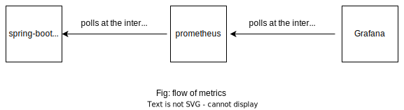

## Run required dependencies
./gradlew bootJar
docker-compose up -d

## Monitoring

- Spring-boot app will expose metrics via actuator endpoints.
- Prometheus polls for the metrics at a regular interval configured in prometheus.yml
- Prometheus stores the metrics which acts as datasource for the grafana
- Grafana polls the data from prometheus at a regular interval and display on the dashboard 

## Create a grafana dash-board
- Add data source
- Set prometheus url: http://prometheus:9090
- Create dashboard by importing json `grafana_dashboard.json`