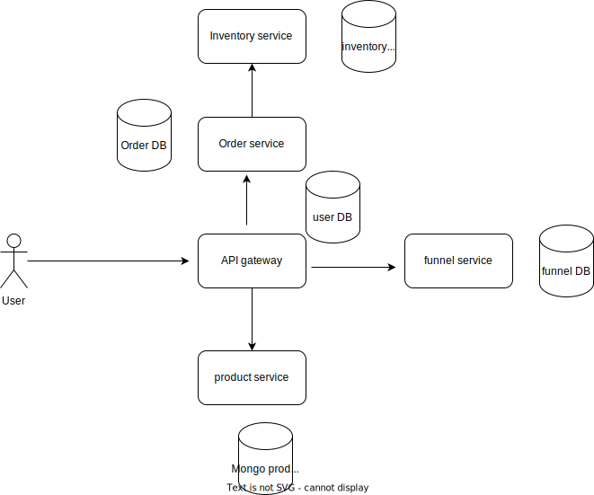

## Architecture


## Run project using docker
```commandline
sh run-project.sh
```

## Run project manually
If you want to run locally, do following steps
1. Run required dependencies
```commandline
 docker-compose -f docker-compose-local.yml up -d
```
2. Run services in the following order
- discovery-server (uses port:8761)
- api-gateway (uses port: 8080)
- product-service (uses port: 8081)
- inventory-service (uses port: 8083)
- order-service (uses port: 8080)
- run funnel-service (uses port: 8000) (Service with different framework)
  ```agsl
    cd funnel-service
    pip install -r requirement.txt
    uvicorn main:app --reload
    ```

## Check if api-gateway is working fine

### Login
POST: localhost:8080/api/auth/login
```json
{
    "username": "binod",
    "password": "binod"
}
```
For each request accept login, we need jwt token which we can get from the `/api/auth/login` api above.

Authorization type: Bearer token

### product-service
POST: localhost:8080/api/product

```json
{
    "name": "iPhone",
    "description": "iPhone14",
    "price": 120
}
```

GET: localhost:8080/api/product

Response:
```agsl
[
    {
        "id": "66d7ee3bd482852c6e6c93c3",
        "name": "iPhone",
        "description": "iPhone14",
        "price": 120
    }
]
```

### order-service with inventory-service

POST: localhost:8080/api/order
```json
{
  "orderLineItems":  [
    {
    "id": 1, 
    "skuCode": "iphone_13",
    "quantity": 10,
    "price": 120
    }
]
}
```

### Service with different framework
GET: localhost:8080/api/funnel

expected response:
```json
{
    "message": "Hello I am from funnel service"
}
```

## Monitoring


- Spring-boot app will expose metrics via actuator endpoints.
- Prometheus polls for the metrics at a regular interval configured in prometheus.yml
- Prometheus stores the metrics which acts as datasource for the grafana
- Grafana polls the data from prometheus at a regular interval and display on the dashboard

## Create a grafana dash-board
- Add data source
- Set prometheus url: http://prometheus:9090
- Create dashboard by importing json `grafana_dashboard.json`
