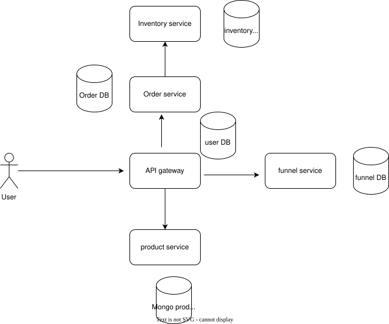
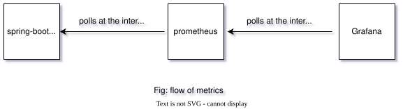

## Architecture


## Tech Stack
| Component | Technology |
|---|---|
| Language | Java 25 |
| Framework | Spring Boot 4.0.5 |
| Service Discovery | Spring Cloud Netflix Eureka |
| API Gateway | Spring Cloud Gateway (WebFlux) |
| Security | Spring Security + JWT |
| Circuit Breaker | Resilience4j |
| Databases | MySQL, MongoDB |
| Tracing | Zipkin + Micrometer Brave |
| Metrics | Prometheus + Grafana |
| Build Tool | Gradle 9.4.1 |
| Container | Docker + Docker Compose |

## Prerequisites
- [Docker](https://docs.docker.com/get-docker/) (with Docker Compose plugin)

> No local Java installation required — the Docker build compiles the source inside the container.

## Run project using Docker
```bash
sh run-project.sh
```
This will build all services from source and start the full stack.

| Service | URL |
|---|---|
| API Gateway | http://localhost:8080 |
| Eureka Dashboard | http://localhost:8761 |
| Zipkin | http://localhost:9411 |
| Prometheus | http://localhost:9090 |
| Grafana | http://localhost:3000 |

## Run project manually (without Docker)

### Prerequisites
- Java 25
- Docker (for dependencies)

### Steps
1. Start required dependencies (MySQL, MongoDB, Zipkin, etc.)
```bash
docker compose -f docker-compose-local.yml up -d
```

2. Run services in the following order:
   - `discovery-server` (port: 8761)
   - `api-gateway` (port: 8080)
   - `product-service` (port: 8081)
   - `inventory-service` (port: 8083)
   - `order-service` (port: 8082)

3. Run `funnel-service` (port: 8000) — Python service
```bash
cd funnel-service
pip install -r requirement.txt
uvicorn main:app --reload
```

## API Reference

### Authentication
All endpoints (except login) require a Bearer JWT token.

**POST** `localhost:8080/api/auth/login`
```json
{
    "username": "binod",
    "password": "binod"
}
```

### product-service

**POST** `localhost:8080/api/product`
```json
{
    "name": "iPhone",
    "description": "iPhone14",
    "price": 120
}
```

**GET** `localhost:8080/api/product`
```json
[
    {
        "id": "66d7ee3bd482852c6e6c93c3",
        "name": "iPhone",
        "description": "iPhone14",
        "price": 120
    }
]
```

### order-service

**POST** `localhost:8080/api/order`
```json
{
  "orderLineItems": [
    {
      "id": 1,
      "skuCode": "iphone_13",
      "quantity": 10,
      "price": 120
    }
  ]
}
```

### funnel-service

**GET** `localhost:8080/api/funnel`
```json
{
    "message": "Hello I am from funnel service"
}
```

## Monitoring



- Spring Boot exposes metrics via Actuator endpoints
- Prometheus scrapes metrics at a regular interval (configured in `prometheus/prometheus.yml`)
- Grafana visualizes the data from Prometheus

### Setting up Grafana
1. Open Grafana at http://localhost:3000 (admin / admin)
2. Add a Prometheus data source with URL: `http://prometheus:9090`
3. Import the dashboard from `grafana_dashboard.json`
